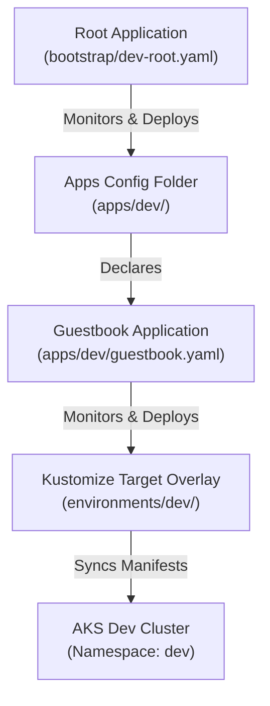
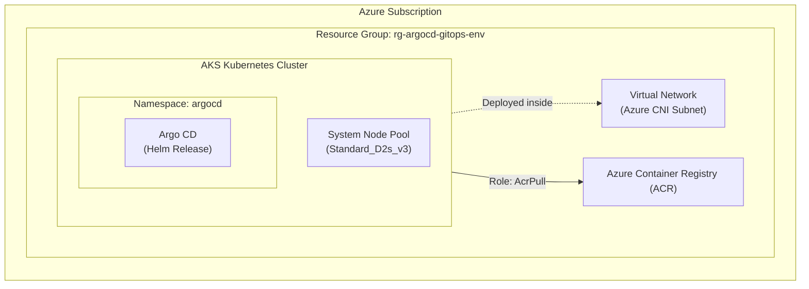

# ArgoCD GitOps Repository

This repository hosts the GitOps configuration for managing Kubernetes applications using ArgoCD. It is structured to support multi-environment deployments using Kustomize overlays.

## Repository Structure

```text
argocd-gitops/
├── bootstrap/             # Bootstrapping files (App-of-Apps pattern)
│   ├── dev-root.yaml      # Root Application for Dev environment
│   └── prod-root.yaml     # Root Application for Prod environment
├── apps/                  # ArgoCD Application definitions
│   ├── dev/               # Dev applications (points to environments/dev)
│   │   └── guestbook.yaml
│   └── prod/              # Prod applications (points to environments/prod)
│       └── guestbook.yaml
├── environments/          # Application manifests organized by environment
│   ├── base/              # Base Kubernetes manifests
│   │   ├── deployment.yaml
│   │   ├── service.yaml
│   │   └── kustomization.yaml
│   ├── dev/               # Dev overlay
│   │   └── kustomization.yaml
│   └── prod/              # Prod overlay
│       └── kustomization.yaml
└── terraform/             # Terraform infrastructure configurations
    ├── clusters/          # Environment cluster configurations
    │   ├── dev/           # Development AKS cluster environment
    │   └── prod/          # Production AKS cluster environment
    └── modules/
        └── aks-gitops/    # Reusable core AKS and Argo CD module
```


## How It Works

This repository uses the **App-of-Apps** pattern:
1. The **Root Application** (in the `bootstrap/` folder) monitors the `apps/<env>/` folder.
2. Any ArgoCD Application manifest defined in `apps/<env>/` is automatically created in ArgoCD.
3. These environment-specific Applications in turn monitor and deploy the manifests defined under `environments/<env>/`.



---

## Bootstrapping ArgoCD

### 1. Dev Environment
To deploy all development applications, apply the Dev Root Application to your cluster:

```bash
kubectl apply -f bootstrap/dev-root.yaml
```

ArgoCD will automatically create the dev `guestbook` application and sync the resources defined in `environments/dev/` to the `dev` namespace.

### 2. Prod Environment
To deploy all production applications, apply the Prod Root Application to your cluster:

```bash
kubectl apply -f bootstrap/prod-root.yaml
```

ArgoCD will automatically create the prod `guestbook` application and sync the resources defined in `environments/prod/` to the `prod` namespace.

---

## Working with Kustomize

* **Base**: Common manifests (e.g. standard Deployment and Service definitions).
* **Overlays (Dev/Prod)**: Specific patches for each environment. For example, the `prod` overlay scales replicas to `3` and updates resource limits, while the `dev` overlay uses `1` replica and custom labels.

---

## Infrastructure Provisioning (Terraform)

The infrastructure for the AKS clusters is defined using Terraform. It is organized into a reusable module and cluster-specific directories to maintain separate state and configurations:

```text
terraform/
├── modules/
│   └── aks-gitops/          # Reusable module for RG, VNet, Subnet, AKS, ACR, and ArgoCD
└── clusters/
    ├── dev/                 # Dev environment cluster definition (1 node)
    └── prod/                # Prod environment cluster definition (3 nodes)
```



### Configuration Details

The core module `aks-gitops` accepts the following variables:

| Variable | Description | Default |
|----------|-------------|---------|
| `environment` | The deployment environment (e.g., `dev`, `prod`) | *Required* |
| `location` | The Azure region where resources will be created | `East US` |
| `resource_group_name` | The name of the resource group | *Required* |
| `cluster_name` | The name of the AKS cluster | *Required* |
| `node_count` | The number of nodes in the system node pool | `1` |
| `vm_size` | The VM size for the system node pool | `Standard_D2s_v3` |
| `acr_name` | The name of the Azure Container Registry | *Required* |
| `vnet_cidr` | The CIDR block for the Virtual Network | `10.0.0.0/8` |
| `subnet_cidr` | The CIDR block for the AKS subnet | `10.240.0.0/16` |

Each cluster environment workspace applies custom default parameters:

* **Development Cluster (`clusters/dev`)**:
  * Resource Group: `rg-argocd-gitops-dev`
  * VNet Network: `10.10.0.0/16` (isolates dev network)
  * AKS Subnet: `10.10.1.0/24`
  * AKS Nodes: `1` node (`Standard_D2s_v3`)
  * ACR Name: `acrargocdgitopsdev` (alphanumeric, globally unique)
* **Production Cluster (`clusters/prod`)**:
  * Resource Group: `rg-argocd-gitops-prod`
  * VNet Network: `10.20.0.0/16` (isolates prod network)
  * AKS Subnet: `10.20.1.0/24`
  * AKS Nodes: `3` nodes (`Standard_D2s_v3` for high availability)
  * ACR Name: `acrargocdgitopsprod` (alphanumeric, globally unique)

### Terraform Outputs

Each environment exposes the following outputs:

* `resource_group_name`: The name of the Resource Group created.
* `aks_cluster_name`: The name of the AKS cluster.
* `acr_name`: The name of the Azure Container Registry.
* `acr_login_server`: The login server URL for the ACR.
* `connect_command`: Ready-to-run Azure CLI command to configure local `kubectl` for cluster connection.
* `argocd_password_bash`: Command (Bash) to retrieve the initial Argo CD admin password.
* `argocd_password_powershell`: Command (PowerShell) to retrieve the initial Argo CD admin password.

### Setup & Deployment

1. **Prerequisites**: Ensure you have Terraform installed, are logged into Azure (`az login`), and have selected the appropriate subscription.
2. **Initialize & Deploy (Dev)**:
   ```bash
   cd terraform/clusters/dev
   terraform init
   terraform apply
   ```
3. **Initialize & Deploy (Prod)**:
   ```bash
   cd terraform/clusters/prod
   terraform init
   terraform apply
   ```

> [!TIP]
> **Dynamic Providers Note**: Terraform configures the Helm/Kubernetes providers using the outputs of the AKS cluster. If applying for the first time on a clean environment, you should target the AKS infrastructure module first, then run a full apply to deploy Argo CD:
> ```bash
> terraform apply -target=module.aks_gitops
> terraform apply
> ```

### Connection & ArgoCD Access

Once Terraform apply completes, configure your local environment and retrieve your ArgoCD credentials:
1. **Configure kubectl**:
   ```bash
   # Run the command output by Terraform:
   az aks get-credentials --resource-group <resource_group> --name <cluster_name>
   ```
2. **Retrieve ArgoCD admin password**:
   - **Bash**: `kubectl -n argocd get secret argocd-initial-admin-secret -o jsonpath="{.data.password}" | base64 --decode`
   - **PowerShell**: `[System.Text.Encoding]::UTF8.GetString([System.Convert]::FromBase64String((kubectl -n argocd get secret argocd-initial-admin-secret -o jsonpath="{.data.password}")))`

---

## Architectural Decisions

### Networking: Azure CNI vs. Kubenet
This deployment defaults to **Azure CNI** (Container Network Interface) for native pod routing and performance.
* **Current Choice (Azure CNI)**: Every pod receives a real IP address from the VNet subnet. This enables direct, low-latency pod-to-pod communication across virtual networks and simplifies integration with other Azure services.
* **Future Consideration (Kubenet)**: Kubenet remains a future consideration to save IP address space. With Azure CNI, a cluster can quickly exhaust subnet IP space because each pod consumes a VNet IP. Kubenet uses IP address space inside the cluster node only and NATs traffic, meaning it only uses one host VNet IP per node. If VNet/Subnet IP address spaces become constrained, migrating to Kubenet networking is recommended.

### Argo CD Access: Public LoadBalancer vs. Secure Ingress Controller
This deployment defaults to exposing the Argo CD API/UI server via a Kubernetes `LoadBalancer` service for simplicity.
* **Current Choice (LoadBalancer Service)**: Argo CD is exposed directly with a public IP address allocated by Azure. This is useful for rapid prototyping and initial setup.
* **Future Consideration (Secure Ingress with TLS)**: Exposing the control plane directly over a public `LoadBalancer` without SSL/TLS certificates or custom DNS names is insecure for production. Future considerations include switching `server.service.type` to `ClusterIP` and using an **Ingress Controller** (e.g., NGINX Ingress Controller) paired with **cert-manager** to automatically manage Let's Encrypt certificates and expose the service securely.
